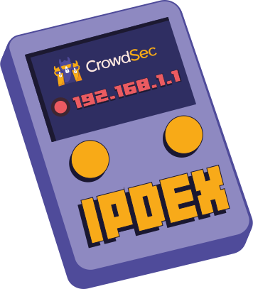
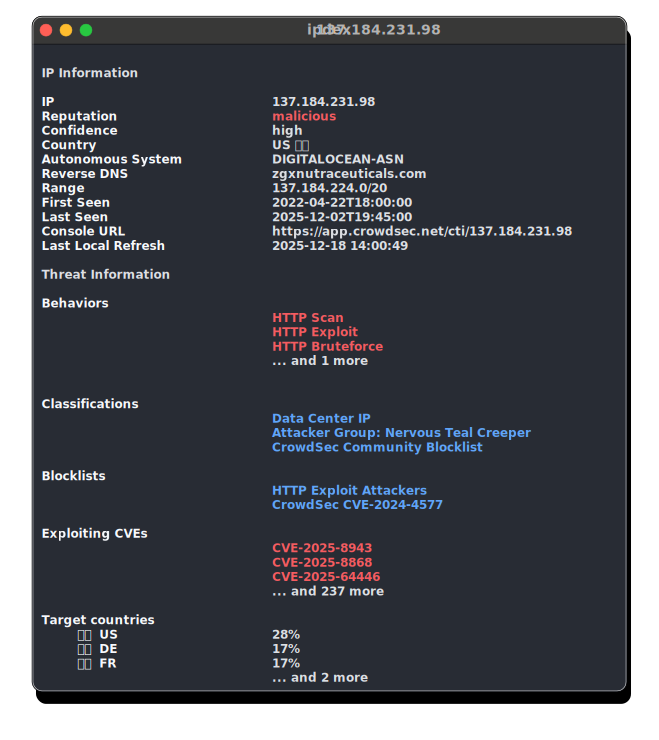
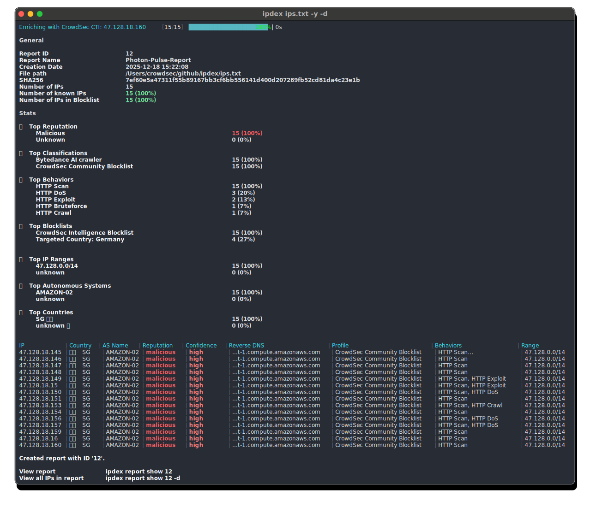
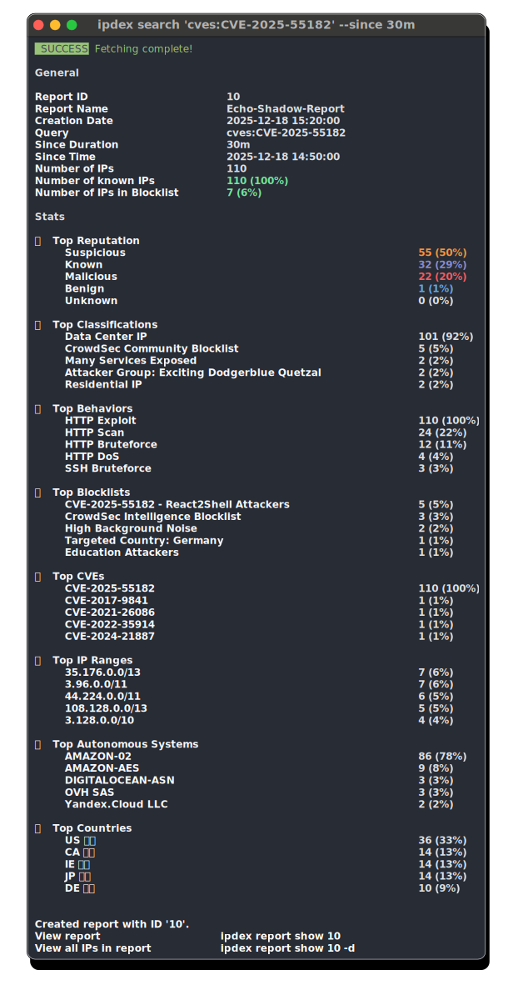

# ipdex

Your ultimate IP dex!

<p align="center">

</p>


**ipdex** is a simple CLI tool to gather insight about a list of IPs or an IP using the [CrowdSec CTI](https://www.crowdsec.net/cyber-threat-intelligence) (Cyber Threat Intelligence) API.

<p align="center">  </p>

---

## Table of Contents

- [ipdex](#ipdex)
  - [Table of Contents](#table-of-contents)
  - [Introduction](#introduction)
  - [Prerequisites](#prerequisites)
  - [Quickstart](#quickstart)
    - [1. Install](#1-install)
      - [Install with Go](#install-with-go)
      - [macOS / Linux](#macos--linux)
        - [Linux](#linux)
        - [macOS](#macos)
      - [Windows](#windows)
    - [2. Make sure the binary is in your PATH](#2-make-sure-the-binary-is-in-your-path)
    - [3. Initialize the tool](#3-initialize-the-tool)
    - [4. Query an IP](#4-query-an-ip)
    - [5. Scan a file](#5-scan-a-file)
  - [Configuration](#configuration)
  - [User Guide](#user-guide)
    - [Scan an IP](#scan-an-ip)
    - [Refresh an IP](#refresh-an-ip)
    - [Scan a file](#scan-a-file)
    - [Refresh a file](#refresh-a-file)
    - [Output formats](#output-formats)
    - [Saving reports to files](#saving-reports-to-files)
    - [`report`](#report)
      - [List reports](#list-reports)
      - [View a report](#view-a-report)
      - [Delete a report](#delete-a-report)
    - [`search`](#search)
      - [Search IPs reported for a specific CVE](#search-ips-reported-for-a-specific-cve)
      - [Search IPs reported for HTTP scan since 30 minutes](#search-ips-reported-for-http-scan-since-30-minutes)
      - [Search malicious VPN or Proxy IPs since 1h and show all IPs](#search-malicious-vpn-or-proxy-ips-since-1h-and-show-all-ips)
    - [`config`](#config)
      - [Show config](#show-config)
      - [Set a new API Key](#set-a-new-api-key)
  - [License](#license)

---

## Introduction

**ipdex** helps analysts and security engineers collect and understand information about IP addresses from CrowdSec CTI.

With this tool you can:
- Check an IP's reputation using CTI
- Scan IP or log files and display detailed reports
- Run [CrowdSec Search Queries](https://docs.crowdsec.net/u/cti_api/search_queries)
- Keep a local history of reports for later inspection


📓 All scanned IPs are cached for 48 hours.

---

## Prerequisites

To use ipdex, you **must** create a CrowdSec Console account in order to create an **API key**.

1. Create an account (free or paid):  
   👉 [https://app.crowdsec.net/](https://app.crowdsec.net/)

2. Go to:  
   👉 `Settings > CTI API Keys`  
   and generate a new API key.

You will use this key during the configuration initialisation.

---

## Quickstart


### 1. Install

#### Install with Go

If you already have [Go](https://go.dev/dl/) installed, you can install **ipdex** directly from the command line.

> ⚠️ You need to have Go **1.24+** installed and your `GOPATH/bin` or `GOBIN` must be in your system's `PATH` environment variable to run the binary from anywhere.


```bash
go install github.com/crowdsecurity/ipdex/cmd/ipdex@latest
```

This will download, build, and place the `ipdex` binary into your `$GOBIN` directory (usually `$HOME/go/bin`).

#### macOS / Linux

Download the binary for your system from the [Releases](https://github.com/crowdsecurity/ipdex/releases) page.

Print your current `PATH` environment variable to see the folders already in it:

```bash
echo $PATH
```

Move the `ipdex` binary to one of the folders listed. For example, if `/usr/local/bin` is in your `PATH`, you can move the binary like this:

##### Linux

```bash
sudo mv ~/Downloads/ipdex_linux_amd64 /usr/local/bin/ipdex
chmod +x /usr/local/bin/ipdex
```

##### macOS

```bash
sudo mv ~/Downloads/ipdex_darwin_arm64 /usr/local/bin/ipdex
chmod +x /usr/local/bin/ipdex
```


#### Windows

Download the binary for your system from the [Releases](https://github.com/crowdsecurity/ipdex/releases) page.


If you're using Windows (or WSL), make sure the folder containing the `ipdex.exe` binary is added to your system `PATH`.

---


### 2. Make sure the binary is in your PATH

To run `ipdex` from anywhere in your terminal, the binary must be in a folder that's part of your `PATH`.

### 3. Initialize the tool

```bash
ipdex init
```

Enter your API key and set your preferences.

### 4. Query an IP

```bash
ipdex 1.2.3.4
```

<p align="center">  </p>

### 5. Scan a file

```bash
ipdex ips.txt
ipdex /var/log/nginx.log
```

<p align="center">  </p>

**💡 Tip:** You can output results in different formats (`-o json`, `-o csv`) and save them to files using `--output-path`. See [Output formats](#output-formats) and [Saving reports to files](#saving-reports-to-files) for more details.

---

## Configuration

Use the `init` command to:
- Enter your **API key**
- Get tips about ipdex

---

## User Guide

All scanned IPs are cached for 48 hours.

### Scan an IP

```
ipdex <IP>
```

### Refresh an IP

```
ipdex <IP> -r
```

### Scan a file

```
ipdex <filepath>
```

### Refresh a file

When running ipdex on a file that has been previously scanned, it will update the existing report. Refreshing the file is particularly useful if some IPs are still cached and you wish to refresh the entire report.

```
ipdex <filepath> -r
```

### Output formats

ipdex supports multiple output formats to suit different use cases using the -o option:

- **human** (default): Interactive, colorized output optimized for terminal viewing
- **json**: `-o json` Machine-readable JSON format for programmatic processing
- **csv**: `-o csv` Comma-separated values format for spreadsheet analysis

### Saving reports to files

You can save reports to disk using the `--output-path` flag. This works with all output formats and automatically creates separate files for the report summary and the detailed IP information (if you used the -d option).

```bash
# Save report as CSV files report and details
ipdex ips.txt -o csv -d --output-path /path/to/output

# This creates:
# - /path/to/output/report_<id>.csv (summary statistics)
# - /path/to/output/report_<id>_details.csv (detailed IP information, when using -d flag)

# You can also do it for an existing report
ipdex report show 18 -o csv --output-path /path/to/output -d

**Note:** When using `--output-path`, reports are saved to files in addition to being displayed in the terminal.

### Display all reports

```
ipdex report list
```

#### Showing a specific report

```
ipdex report show <report ID> # -d to see all IPs
```

## Commands

### `init`

Setup your configuration for the first time:

```bash
ipdex init
```

Interactive prompts will help you enter:
- API key (required)

---

### `report`

Manage your local reports.

#### List reports

```bash
ipdex report list
```

#### View a report

```bash
# View a report in human-readable format
ipdex report show 2

# View report with details as CSV and save
ipdex report show 2 -o csv --output-path ./exports -d
```

#### Delete a report

```bash
ipdex report delete 2
```

---

### `search`

You can find the documentation for search queries [here](https://docs.crowdsec.net/u/cti_api/search_queries).

By default, the `since` parameter is set to `30d`.

- For the free plan, the page size is limited to `10`.
- For premium plans, the page size increases to `1000`.

⚠️ Each queried page counts as 1 quota.

<p align="center">  </p>

#### Search IPs reported for a specific CVE

```bash
ipdex search "cves:CVE-2025-2748"
```

#### Search IPs reported for HTTP scan since 30 minutes 

```bash
ipdex search 'behaviors.label:"HTTP Scan"' --since 30m
```

#### Search malicious VPN or Proxy IPs since 1h and show all IPs

```bash
ipdex search 'classifications.classifications.label:"VPN or Proxy" AND reputation:malicious' --since 1h -d
```

---

### `config`

Manually view or change your saved config:

```bash
ipdex config
```

#### Show config

```bash
ipdex config show
```

#### Set a new API Key

```bash
ipdex config set --api-key <API-KEY>
```

---

## License

MIT License — see the [LICENSE](LICENSE) file.

---

